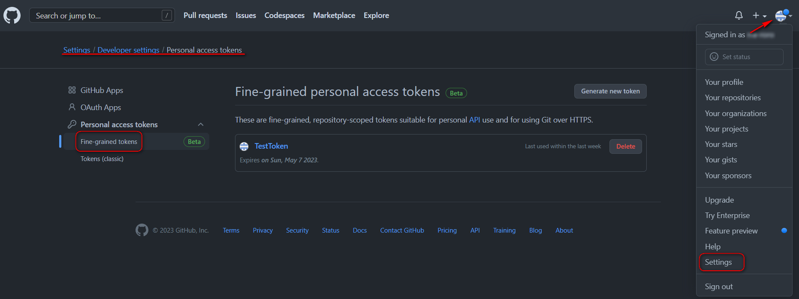
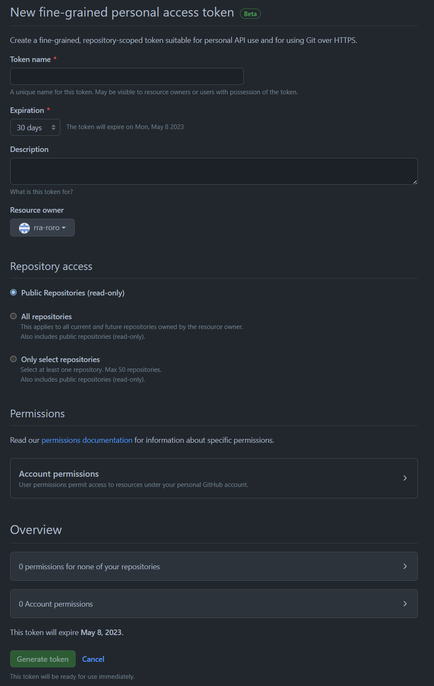
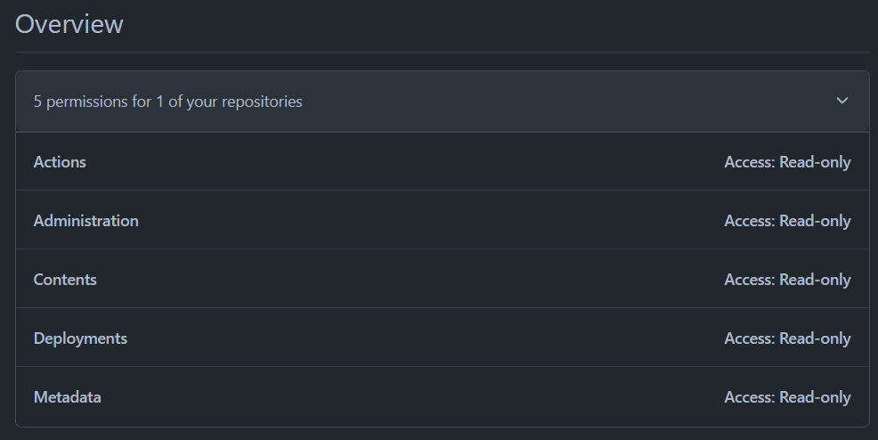

Получение токенов для приватных repo github
===========================================

Для скачивания архива приватного репозитория, используется следующая комманда:

~~~~~~~~~~~~~~~~~~~~~~~~~~~~~~~~~~~~~~~~~~~~~~~~~~~~~~~~~~~~~~~~~~~~~~~~~~~~~~~~
curl -L \
 -H "Accept: application/vnd.github+json" \
 -H "Authorization: Bearer <YOUR-TOKEN>"\
 -H "X-GitHub-Api-Version: 2022-11-28" \
 https://api.github.com/repos/OWNER/REPO/zipball/REF
~~~~~~~~~~~~~~~~~~~~~~~~~~~~~~~~~~~~~~~~~~~~~~~~~~~~~~~~~~~~~~~~~~~~~~~~~~~~~~~~

Если вы хотите получить доступ к файлу из частного репо, вам сначала нужно
создать токен доступа`<YOUR-TOKEN>` с соответствующими разрешениями в настройках
вашей учетной записи.

Существуют несколько типов токенов, см подробнее
[тут](https://docs.github.com/en/authentication/keeping-your-account-and-data-secure/about-authentication-to-github#githubs-token-formats)

Нам нужен токен с префиксом `github_pat_` - это **fine-grained** персональный
токен доступа. Подробнее смотри
[тут](https://docs.github.com/en/authentication/keeping-your-account-and-data-secure/creating-a-personal-access-token#creating-a-fine-grained-personal-access-token)

Получения токена показано на рисунке ниже:

Щелкните **Generate new token**

1.  В разделе **Имя токена** введите имя токена.

2.  В **разделе Срок действия** выберите срок действия токена.

3.  При необходимости в разделе **«Описание»** добавьте примечание, описывающее
    назначение токена.

4.  В разделе **Владелец ресурса** выберите владельца ресурса. Токен сможет
    получить доступ только к ресурсам, принадлежащим выбранному владельцу
    ресурса. Организации, членом которых вы являетесь, не будут отображаться,
    если только организация не согласилась на использование токенов личного
    доступа. Дополнительные сведения см. в разделе « [Настройка политики
    маркеров личного доступа для вашей
    организации](https://docs.github.com/en/organizations/managing-programmatic-access-to-your-organization/setting-a-personal-access-token-policy-for-your-organization) ».

5.  При необходимости, если владельцем ресурса является организация, требующая
    утверждения токенов личного доступа, под владельцем ресурса в поле введите
    обоснование запроса.

6.  В разделе **Доступ к репозиторию** выберите, к каким репозиториям вы хотите
    получить доступ с помощью токена. Вы должны выбрать минимальный доступ к
    репозиторию, соответствующий вашим потребностям. Токены всегда включают
    доступ только для чтения ко всем общедоступным репозиториям на GitHub.

7.  Если вы выбрали **Только выбирать репозитории** на предыдущем шаге, в
    раскрывающемся списке **Выбранные репозитории** выберите репозитории, к
    которым вы хотите получить доступ с помощью токена.

8.  В **разделе Разрешения** выберите, какие разрешения предоставить токену. В
    зависимости от того, какой владелец ресурса и какой доступ к репозиторию вы
    указали, существуют разрешения на репозиторий, организацию и учетную
    запись. Вы должны выбрать минимальные разрешения, необходимые для ваших
    нужд. Дополнительные сведения о том, какие разрешения требуются для каждой
    операции REST API, см. в разделе « [Разрешения, необходимые для тонких
    токенов личного
    доступа](https://docs.github.com/en/rest/overview/permissions-required-for-fine-grained-personal-access-tokens) ».

9.  Щелкните **Создать токен** .

 

Какие разрешения необходимы токену, для скачивания архива приватного репозитория
================================================================================

